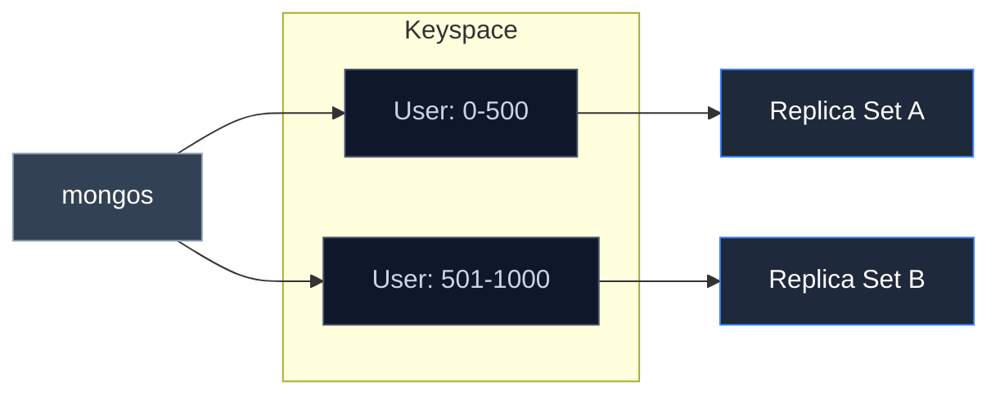
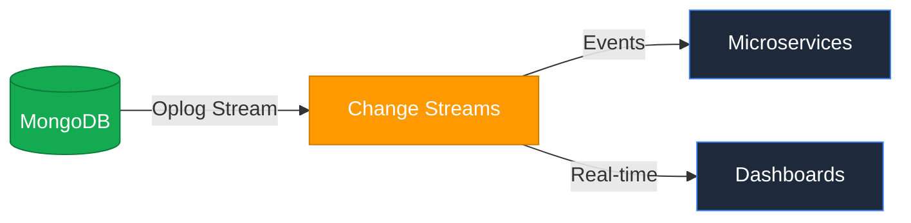

# Introduction to MongoDB
## From Relational Rigidity to Distributed Flexibility

<div class="pt-12">
  <span @click="$nav.next" class="px-5 py-3 rounded-lg cursor-pointer hover:bg-white/10 transition-all border border-white/20 backdrop-blur-md">
    Begin Presentation <carbon-arrow-right class="inline-block ml-2 align-middle" />
  </span>
</div>

<div class="abs-br m-6 flex gap-3 text-white/50">
  <button @click="$nav.prev" class="text-xl hover:text-white transition"><carbon-chevron-left /></button>
  <button @click="$nav.next" class="text-xl hover:text-white transition"><carbon-chevron-right /></button>
</div>

<!--
This presentation provides a technical introduction to MongoDB, designed for students with a background in traditional relational database systems.
-->

---
layout: two-cols
---

# The Impedance Mismatch
### Why Document Stores?

Relational databases require "flattening" hierarchical objects into rows and columns, leading to <b>Object-Relational Impedance Mismatch</b>.

- <b>Normalization</b>: Splitting data into many tables to ensure integrity.
- <b>Complexity</b>: Deeply nested data requires multiple $O(N \log N)$ JOINs.
- <b>Rigidity</b>: Schema changes require downtime for large datasets.

::right::

<div class="ml-4 h-full flex flex-col justify-center">

<v-click>
<div class="p-4 bg-gray-800/50 rounded-lg border border-white/10 shadow-xl">
<h3 class="text-secondary font-bold mb-2">The Solution: BSON</h3>

```json {monaco}
{
  "_id": ObjectId("64f..."),
  "user": "Ashutosh",
  "metadata": {
    "count": 42,
    "last": ISODate("2026-04-15")
  },
  "roles": ["admin", "dev"],
  "v": 2.0
}
```
</div>
</v-click>

<div v-after class="mt-4 text-sm opacity-80">
BSON (Binary JSON) extends JSON with support for types like <b>Decimal128</b>, <b>Date</b>, and <b>Binary Data</b>.
</div>

</div>

---
layout: center
class: text-center
---

# High Availability
### Replica Set Architecture

Replica Sets provide redundancy and self-healing capabilities without a single point of failure.

<div class="grid grid-cols-3 gap-8 pt-10">
  <div v-motion
    :initial="{ opacity: 0, y: 30 }"
    :enter="{ opacity: 1, y: 0, transition: { delay: 100 } }"
    class="p-6 border rounded-xl border-primary bg-primary/5 shadow-lg relative">
    <carbon-cloud-service-management class="text-5xl mb-4 mx-auto text-primary" />
    <h3 class="font-bold text-xl mb-2">Primary</h3>
    <p class="text-xs opacity-70">Single source for Write operations. Maintains the Oplog.</p>
  </div>
  
  <div v-motion
    :initial="{ opacity: 0, y: 30 }"
    :enter="{ opacity: 1, y: 0, transition: { delay: 300 } }"
    class="p-6 border rounded-xl border-gray-600 bg-gray-600/5">
    <carbon-data-share class="text-5xl mb-4 mx-auto opacity-50" />
    <h3 class="font-bold text-xl mb-2">Secondary</h3>
    <p class="text-xs opacity-70">Asynchronously replicates the Oplog. Ready for election.</p>
  </div>

  <div v-motion
    :initial="{ opacity: 0, y: 30 }"
    :enter="{ opacity: 1, y: 0, transition: { delay: 500 } }"
    class="p-6 border rounded-xl border-gray-600 bg-gray-600/5">
    <carbon-data-share class="text-5xl mb-4 mx-auto opacity-50" />
    <h3 class="font-bold text-xl mb-2">Secondary</h3>
    <p class="text-xs opacity-70">Supports Read scalability and quorum maintenance.</p>
  </div>
</div>

<v-click>
<div class="mt-12 p-3 bg-blue-500/10 rounded-lg text-sm border-l-4 border-blue-500">
  <b>Consensus Algorithm:</b> MongoDB uses a variant of the Raft protocol for leader election during failover.
</div>
</v-click>

---

# Horizontal Scaling
### Data Partitioning (Sharding)

Sharding splits the <b>Key Space</b> to distribute load across multiple clusters.

<div class="flex justify-center mt-4">
<Transform :scale="0.95">


</Transform>
</div>

<div class="grid grid-cols-2 gap-8 mt-4 text-sm">
  <div v-click class="p-4 bg-gray-800/40 rounded border border-white/10 text-balance">
    <b>Shard Key Selection</b>: Partitioning strategy (Hashed vs Ranged) is critical to prevent "hotspots" in the distributed cluster.
  </div>
  <div v-click class="p-4 bg-gray-800/40 rounded border border-white/10 text-balance">
    <b>Query Routing</b>: The mongos router uses metadata from Config Servers to target specific shards, minimizing cluster-wide broadcasts.
  </div>
</div>

---

# Data Transformation
### The Aggregation Pipeline

Similar to the Unix <b>|</b> pipe, MongoDB processes data through a sequence of functional stages.

````md magic-move
```js [1. Selection]
// Select active documents
db.orders.aggregate([
  { $match: { status: "A" } }
])
```
```js [2. Reduction]
// Group and compute metrics
db.orders.aggregate([
  { $match: { status: "A" } },
  { $group: { 
      _id: "$cust_id", 
      total: { $sum: "$amount" } 
    } 
  }
])
```
```js [3. Finalization]
// Sort results and restrict output
db.orders.aggregate([
  { $match: { status: "A" } },
  { $group: { _id: "$cust_id", total: { $sum: "$amount" } } },
  { $sort: { total: -1 } },
  { $limit: 10 }
])
```
````

<v-click>
<div class="mt-8 text-center text-xs opacity-50">
  Note: Aggregation stages are optimized by the Query Engine (e.g., <b>$match pushdown</b>).
</div>
</v-click>

---

# Real-time Systems
### Event-Driven Architecture

MongoDB's <b>Oplog</b> serves as a distributed commit log for reactive systems.

<div class="flex justify-center mt-2">
<Transform :scale="1.5">


</Transform>
</div>

<div class="grid grid-cols-3 gap-4 mt-8 text-xs opacity-90">
  <div class="p-3 bg-primary/5 rounded border border-primary/20">
    <carbon-flow-stream class="text-xl mb-1 text-primary" />
    <b>Atlas Streams</b>: Continuous computation on high-velocity ingest.
  </div>
  <div class="p-3 bg-primary/5 rounded border border-primary/20">
    <carbon-notification class="text-xl mb-1 text-primary" />
    <b>Change Streams</b>: Filtered, resumable real-time event notifications.
  </div>
  <div class="p-3 bg-primary/5 rounded border border-primary/20">
    <carbon-timer class="text-xl mb-1 text-primary" />
    <b>Time-Series</b>: Optimized buckets for compressed telemetry data.
  </div>
</div>

---

# Consistency Models
### ACID vs. Flexible Consistency

Traditional RDBMS rely on <b>Serializable Schedules</b>. MongoDB provides <b>Causal Consistency</b> for distributed scale.

| Property | Relational (SQL) | MongoDB (Document) |
| --- | --- | --- |
| <b>Integrity</b> | Foreign Keys | Embedding / Denormalization |
| <b>Consistency</b> | Strict Serializable | Tunable (Eventual to Strong) |
| <b>Joins</b> | Normalized (JOIN) | Locality (Read-from) |

<v-click>
<div class="mt-6 p-4 bg-blue-500/10 rounded-xl border border-blue-500/30 text-sm">
  <h4 class="font-bold text-blue-400 mb-1 italic">The "Read-from" Relationship Insight:</h4>
  "By embedding related data, we optimize for <b>read-from</b> efficiency. We trade the strict serializability of multi-table schedules for the performance of single-document locality."
</div>
</v-click>

---
layout: center
---

# Modern AI Integration
### Vector Search Architecture

MongoDB decouples search compute from operational storage to support AI workloads.

<div class="flex justify-center items-center gap-16 mt-10">
  <div class="text-center group">
    <div class="w-24 h-24 bg-primary/10 rounded-full flex items-center justify-center mb-4 border border-primary/40 group-hover:scale-110 transition">
      <carbon-data-base class="text-4xl text-primary"/>
    </div>
    <span class="text-xs font-bold uppercase tracking-wider">Storage Nodes</span>
  </div>

  <carbon-arrows-horizontal class="text-4xl opacity-20"/>

  <div class="text-center group">
    <div class="w-24 h-24 bg-secondary/10 rounded-full flex items-center justify-center mb-4 border border-secondary/40 group-hover:scale-110 transition">
      <carbon-search class="text-4xl text-secondary animate-pulse"/>
    </div>
    <span class="text-xs font-bold uppercase tracking-wider">Search Nodes</span>
  </div>
</div>

<v-click>
<div class="mt-12 text-center max-w-2xl mx-auto space-y-4">
  <p><b>Vector Search Nodes</b>: Dedicated compute for k-NN (k-Nearest Neighbor) indexing.</p>
  <p class="text-sm opacity-70">Enables Retrieval-Augmented Generation (RAG) by storing and searching high-dimensional embeddings alongside operational metadata.</p>
</div>
</v-click>

---
layout: end
---

# Technical Review
## Documentation: mongodb.com/docs

<div class="mt-24 grid grid-cols-3 gap-4">
  <div class="text-center">
    <p class="text-lg font-serif">Ashutosh Sononey</p>
    <p class="text-xs opacity-50 tracking-widest uppercase">Roll: 10638</p>
  </div>
  <div class="text-center border-x border-white/10">
    <p class="text-lg font-serif">Justin Roy</p>
    <p class="text-xs opacity-50 tracking-widest uppercase">Roll: 10639</p>
  </div>
  <div class="text-center">
    <p class="text-lg font-serif">Bhavesh Yadav</p>
    <p class="text-xs opacity-50 tracking-widest uppercase">Roll: 10641</p>
  </div>
</div>
