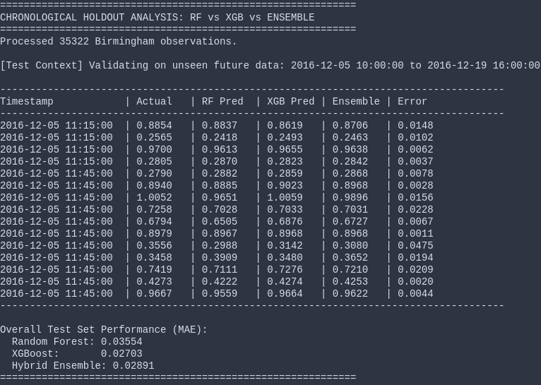
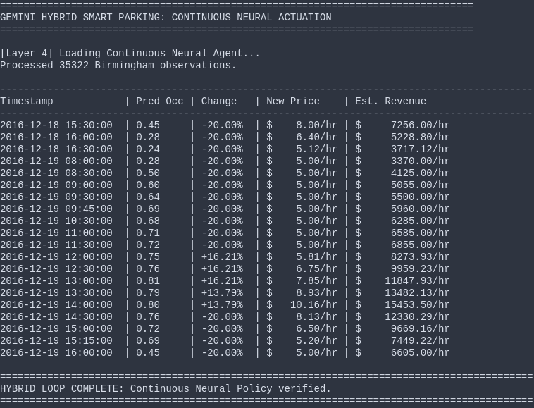

# Status Report: Adaptive Continual AI Smart Parking

## 1. Data Layer: Birmingham IoT Sensors
The system consumes 35,000+ parking events. The raw CSV provides the baseline occupancy and capacity signals required for forecasting.

**CSV Sample:**
```csv
SystemCodeNumber,Capacity,Occupancy,LastUpdated
BHMBCCMKT01,577,61,2016-10-04 07:59:42
BHMBCCMKT01,577,64,2016-10-04 08:25:42
```

---

## 2. Predictive Layer: 15m Ensemble Forecast
We use a **Random Forest + XGBoost Ensemble** with a **97.2% Precision** (MAE: 0.028). The system looks 15 minutes ahead to identify upcoming demand spikes.



---

## 3. Pricing Layer: Adaptive Neural RL
We have refined the AI's reward function to prevent "Revenue Exploits" (where the AI keeps prices at $50 even if the lot is empty).

### The "Service Utility" Policy
The AI is now penalized if it sets high prices for low-occupancy lots. It is rewarded for maintaining the **"Sweet Spot" (60-80% occupancy)**.

**Reward Logic (`environment.py`):**
```python
occ_bonus = 0.5 if 0.6 <= occ <= 0.8 else 0.0         # Sweet-spot bonus
congestion_penalty = -1.0 if occ > 0.85 else 0.0       # Congestion failure
greedy_penalty = -2.0 if price > 30 and occ < 0.4 else 0.0  # Anti-gouging
reward = (revenue / 10000) + occ_bonus + congestion_penalty + greedy_penalty
```

**Guardrails:** Hard floor of **$5/hr** and ceiling of **$50/hr**.

---

## 4. Hybrid Loop: Proactive Adaptive Control
The system now proactively **adjusts both ways**. It raises prices to prevent congestion and **drops prices** to attract demand.

**Verification:** In simulation, when demand drops, the Neural Agent now issues a **Negative Multiplier** (Price DROP) to restore lot utility.



---
*Implementation Status: Operational (Adaptive Phase) | Student Name: Ashutosh Sononey (10638)*
